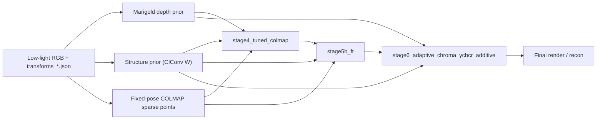

# 3DRR Low-Light 方法介绍

本文档介绍当前代码库 [3DRR_low_light](/D:/github/3dgs-low-light/3DRR_low_light) 中保留下来的最佳低照度 3D Gaussian Splatting 管线。该版本只围绕以下三阶段主线展开：

1. `stage4_tuned_colmap`
2. `stage5b_ft`
3. `stage6_adaptive_chroma_ycbcr_additive`

对应配置目录：

- [stage4_tuned_colmap](/D:/github/3dgs-low-light/3DRR_low_light/config/stage4_tuned_colmap)
- [stage5b_ft](/D:/github/3dgs-low-light/3DRR_low_light/config/stage5b_ft)
- [stage6_adaptive_chroma_ycbcr_additive](/D:/github/3dgs-low-light/3DRR_low_light/config/stage6_adaptive_chroma_ycbcr_additive)

核心方法思想可以概括为两点：

- 用固定官方位姿下的 COLMAP sparse points 替代过强的单目深度几何初始化，并在第二阶段继续把 sparse geometry 当作弱几何锚点。
- 在最终阶段把亮度恢复与色彩恢复解耦，使用标量 illumination 负责亮度，用 YCbCr 空间下的小幅 additive chroma residual 负责色彩修正。

## 1. 整体流程



整条管线的职责划分是明确的：

- 第一阶段负责建立稳定几何底座。
- 第二阶段负责在不再 densify 的前提下补结构、稳几何。
- 第三阶段不再追求大幅几何变化，而是集中做低照外观恢复。

这也是为什么历史上尝试过的单阶段合并训练没有进入最终主线：几何与外观在同一条优化轨迹里同时被强先验驱动时，更容易出现局部漂浮、片状错误面和色彩异常。

## 2. 代码结构与模块分工

### 2.1 顶层入口

- [train.py](/D:/github/3dgs-low-light/3DRR_low_light/train.py)
  - 训练主入口
  - 负责加载配置、构造模型、建立优化器、组织验证与保存可视化
- [eval.py](/D:/github/3dgs-low-light/3DRR_low_light/eval.py)
  - 评估入口
  - 负责加载 checkpoint、渲染 `test/base/recon/illum/chroma` 等输出

### 2.2 数据与预处理

- [blender.py](/D:/github/3dgs-low-light/3DRR_low_light/core/data/blender.py)
  - 读取 Blender 风格场景
  - 同时加载 RGB 与辅助先验
  - 当前会优先读取 `.npy` 深度先验
- [augment.py](/D:/github/3dgs-low-light/3DRR_low_light/core/libs/augment.py)
  - 负责训练时 low-light augmentation
  - 生成 `supervision` 与 `proxy_target`
- [extract_marigold_depth.py](/D:/github/3dgs-low-light/3DRR_low_light/tools/extract_marigold_depth.py)
  - 提取单目深度先验
- [extract_structure_prior.py](/D:/github/3dgs-low-light/3DRR_low_light/tools/extract_structure_prior.py)
  - 生成结构先验图
- [build_fixed_pose_colmap_sparse_init.py](/D:/github/3dgs-low-light/3DRR_low_light/tools/build_fixed_pose_colmap_sparse_init.py)
  - 在固定官方位姿下导出 COLMAP sparse points

### 2.3 模型与损失

- [simple_3dgs.py](/D:/github/3dgs-low-light/3DRR_low_light/core/model/simple_3dgs.py)
  - 定义 Gaussian 参数
  - 定义初始化逻辑
  - 定义 illumination 与 chroma 辅助头
- [builder.py](/D:/github/3dgs-low-light/3DRR_low_light/core/losses/builder.py)
  - 按配置组装 loss modules
- [modules.py](/D:/github/3dgs-low-light/3DRR_low_light/core/losses/modules.py)
  - 实现各类 loss
- [losses.py](/D:/github/3dgs-low-light/3DRR_low_light/core/libs/losses.py)
  - 公共图像空间变换与 chroma residual 操作

## 3. 输入数据与辅助先验

每个场景数据目录应至少包含：

- `transforms_train.json`
- `transforms_val.json`
- `transforms_test.json`
- 对应 RGB 图像

辅助先验位于：

- `auxiliaries/depth/`
- `auxiliaries/structure/`
- `auxiliaries/colmap_sparse/`

三类先验分别承担不同角色：

- `depth`
  - 提供弱几何趋势
  - 不再被当作高可信几何真值
- `structure`
  - 提供 illumination-invariant 的结构响应
  - 更适合作为细结构约束
- `colmap_sparse`
  - 提供多视图一致的稀疏几何锚点
  - 既用于初始化，也用于第二阶段的弱训练期约束

## 4. 模型参数与渲染头

在 [Simple3DGS](/D:/github/3dgs-low-light/3DRR_low_light/core/model/simple_3dgs.py) 中，每个 Gaussian 除基本参数外，还维护了若干辅助属性：

- 几何相关
  - `means`
  - `quats`
  - `scales`
  - `opacities`
- 外观相关
  - `sh0`
  - `shN`
- 先验与外观辅助头
  - `depth_feat`
  - `prior_feat`
  - `illum_feat`
  - `chroma_feat`

其中：

- `depth_feat` 渲染为 `geom_depth`
- `prior_feat` 渲染为 `prior_aux`
- `illum_feat` 渲染为 `illum_aux`
- `chroma_feat` 渲染为 `chroma_aux`

`forward()` 的核心输出包括：

- `rgb`
- `geom_depth`
- `alpha`
- `prior_aux`
- `illum_aux`
- `chroma_aux`
- `base_lit_rgb`
- `recon_rgb`

第三阶段中，`recon_rgb` 的形成过程是：

1. 用 `illum_aux` 生成标量亮度因子  
   `illum_factor = 2 * sigmoid(illum_aux)`
2. 亮度恢复  
   `base_lit_rgb = clamp(rgb * illum_factor, 0, 1)`
3. 将 `base_lit_rgb` 转到 YCbCr
4. 用 `chroma_aux` 仅修正 `Cb/Cr`
5. 转回 RGB 得到 `recon_rgb`

因此第三阶段是显式解耦的：

- `illum` 负责亮度
- `chroma` 负责色度

## 5. 初始化：`hybrid_anchor_colmap_sparse`

第一阶段不再使用强单目深度反投影作为主要初始化，而是使用 `hybrid_anchor_colmap_sparse`。

实现位置：

- [simple_3dgs.py](/D:/github/3dgs-low-light/3DRR_low_light/core/model/simple_3dgs.py)

初始化组成由三部分构成：

1. 少量随机点
2. COLMAP sparse points
3. anchor points

但在最终最佳配置中，第一阶段实际更偏向：

- `INIT_ANCHOR_RATIO: 0.00`
- `INIT_COLMAP_RATIO: 0.20`
- `INIT_COLMAP_USE_ALL: true`
- `INIT_RANDOM_POINTS: 5000`

也就是说，`stage4_tuned_colmap` 实际上以 COLMAP 稀疏点为主导几何锚点，随机点只作为探索项。

其优点是：

- sparse points 是多视图一致的
- 比单目深度更不容易把错误几何直接写入初始化
- 对细结构、遮挡复杂、颜色失真的场景更稳

## 6. 第一阶段：`stage4_tuned_colmap`

目标：建立几何底座。

代表配置可见：

- [laboratory.yaml](/D:/github/3dgs-low-light/3DRR_low_light/config/stage4_tuned_colmap/laboratory.yaml)

### 6.1 核心策略

- 初始化采用 `hybrid_anchor_colmap_sparse`
- 前 `5000` step 允许 densify
- `5000` step 后引入弱几何先验

### 6.2 使用的监督

- 基础 RGB 重建
- `SSIM`
- `weak exposure`
- `DepthPriorLoss`
- `MultiViewReprojectionLoss`

### 6.3 先验时序

- `DEPTH.START_STEP = 5000`
- `MULTIVIEW.START_STEP = 5000`
- `STRUCTURE` 在这一阶段关闭

这里的设计意图是：

- densify 先把高斯集合长出来
- 再用弱深度与弱多视图一致性稳住几何

### 6.4 为什么不在第一阶段就开 structure

实验表明，把结构先验过早并入初始化阶段，容易让几何和结构响应互相争夺解释权，尤其在 `Laboratory` 这类复杂场景中更容易诱发局部错误面。因此结构约束被推迟到第二阶段。

## 7. 第二阶段：`stage5b_ft`

目标：在已经稳定的底座上补结构、稳几何。

代表配置可见：

- [laboratory.yaml](/D:/github/3dgs-low-light/3DRR_low_light/config/stage5b_ft/laboratory.yaml)

### 7.1 warm-start 方式

`stage5b_ft` 直接从第一阶段的 `step_15000.pt` 继续：

- `WARMSTART_CHECKPOINT = outputs/stage4_tuned_colmap/{Scene}/step_15000/step_15000.pt`

这是整条最佳管线成立的关键：

- 不是在一条训练轨迹里把所有先验同时打开
- 而是先固定一个几何底座，再在新阶段短程微调

### 7.2 no-densify

在第二阶段：

- `DENSIFY_START_STEP = 6000`
- `DENSIFY_STOP_STEP = 6000`

也就是实际不再 densify。

这一设计的作用是：

- 避免在结构先验进入后又复制扩张错误高斯
- 让第二阶段更像“重排和微调已有高斯”，而不是“继续增殖”

### 7.3 使用的监督

第二阶段保留：

- RGB reconstruction
- `SSIM`
- `weak exposure`
- `DepthPriorLoss`
- `StructurePriorLoss`
- `SparsePointRegularizationLoss`

关闭：

- `MULTIVIEW`

### 7.4 `SparsePointRegularizationLoss`

这是当前 pipeline 里最核心的方法点之一。

实现位置：

- [modules.py](/D:/github/3dgs-low-light/3DRR_low_light/core/losses/modules.py)

其思想不是让 COLMAP sparse points 只在初始化时起作用一次，而是继续把 sparse geometry 当作弱训练期锚点：

- 每步从高 opacity 的 Gaussian 中采样一小批
- 为其寻找最近 sparse points
- 对距离做截断约束

关键配置：

- `WEIGHT: 0.002`
- `SAMPLE_POINTS: 1024`
- `MIN_OPACITY: 0.2`
- `DISTANCE_CLAMP: 0.05`

这样做的优点是：

- 约束是弱的，不会像强深度先验那样把几何锁死
- 但它能持续提醒模型哪些区域应更贴近多视图一致的稀疏几何

### 7.5 `StructurePriorLoss`

`structure prior` 来自离线提取的 `auxiliaries/structure/` 图。

实现位置：

- [structure_prior.py](/D:/github/3dgs-low-light/3DRR_low_light/core/losses/structure_prior.py)
- [modules.py](/D:/github/3dgs-low-light/3DRR_low_light/core/losses/modules.py)

它在第二阶段从 step 0 启用，作用是：

- 对细结构和轮廓提供 illumination-invariant 的辅助约束
- 弥补深度先验在低纹理、反光、细结构场景中的不稳定性

因此，第二阶段本质上是：

- 以 `structure` 为主
- `depth` 为辅
- `sparse-guided` 持续锚定几何

## 8. 第三阶段：`stage6_adaptive_chroma_ycbcr_additive`

目标：做外观恢复，而不是继续强行修几何。

代表配置可见：

- [milkcookie.yaml](/D:/github/3dgs-low-light/3DRR_low_light/config/stage6_adaptive_chroma_ycbcr_additive/milkcookie.yaml)

### 8.1 warm-start 来源

第三阶段从第二阶段的 `step_5000.pt` 继续：

- `WARMSTART_CHECKPOINT = outputs/stage5b_ft/{Scene}/step_5000/step_5000.pt`

同样关闭 densify：

- `DENSIFY_START_STEP = 6000`
- `DENSIFY_STOP_STEP = 6000`

### 8.2 使用的监督

第三阶段保留：

- 基础 RGB reconstruction
- `ReconstructionLoss` 对 `proxy_target`
- `DepthPriorLoss`
- `StructurePriorLoss`
- `ChromaResidualRegularizationLoss`

关闭：

- `MULTIVIEW`

第三阶段之所以不再把 multiview 作为主力项，是因为实验表明：

- 当前这套渲染深度自一致项更像自洽约束
- 并不足以在该阶段继续显著修复顽固几何问题

### 8.3 `proxy_target` 与自适应亮度标定

实现位置：

- [augment.py](/D:/github/3dgs-low-light/3DRR_low_light/core/libs/augment.py)

第三阶段不直接拿一个固定亮度目标去监督，而是先生成 `proxy_target`。

当前最有效的设置包括：

- `FORM = shadow_blend`
- `CALIBRATION_MODE = stat_ratio`

这意味着：

- 先基于当前图像统计量生成提亮目标
- 再按场景/帧统计量对目标亮度做受限校正

作用是：

- 避免所有场景一刀切地用同一亮度均值
- 对 `MilkCookie` 这类偏暗场景尤其重要

### 8.4 confidence-aware reconstruction weighting

在 `ReconstructionLoss` 中，最终 `recon_rgb -> proxy_target` 的监督不是全图等权，而是使用权重图：

- 暗区可更积极
- 亮区更保守
- 低置信区域不强推
- `structure` 较强区域可适度放大重建约束

相关配置：

- `RECON_WEIGHT_MAP_ENABLED: true`
- `RECON_BRIGHT_THRESHOLD`
- `RECON_BRIGHT_SUPPRESSION`
- `RECON_CONFIDENCE_FLOOR`
- `RECON_STRUCTURE_POWER`

这样做的意义是：

- 外观恢复不再是全局一刀切
- 可减少在高亮和低置信区域的过度重建

### 8.5 scalar illumination + additive YCbCr chroma residual

这是当前第三阶段最有效的 appearance design。

#### illumination head

- `illum_feat` 是 1 通道
- 渲染得到 `illum_aux`
- 形成亮度因子：
  - `illum_factor = 2 * sigmoid(illum_aux)`

它只负责：

- 曝光
- 亮度恢复

#### chroma residual

- `chroma_feat` 是 2 通道
- 渲染得到 `chroma_aux`
- 在 YCbCr 空间里只修正 `Cb/Cr`

当前最优形式是 additive：

- `Cb' = Cb + delta_cb`
- `Cr' = Cr + delta_cr`
- `delta = scale * tanh(chroma_aux)`

对应实现：

- [losses.py](/D:/github/3dgs-low-light/3DRR_low_light/core/libs/losses.py)

为什么最终保留 additive 而不是 multiplicative：

- 在低饱和区域，`Cb/Cr` 本身常接近 0
- 乘法修正对这些区域效果太弱
- 加法修正更容易真正缓解整体偏绿、偏闷问题

### 8.6 `ChromaResidualRegularizationLoss`

为了避免 chroma 分支过度自由，第三阶段还加了：

- `LAMBDA_CHROMA_REG`

它的作用是：

- 让色度修正保持在小幅范围内
- 防止 chroma 分支变成另一个高自由度后处理器

## 9. Loss 之间如何协同

当前保留的关键 loss 及其职责如下：

### 9.1 `RGBReconstructionLoss`

- 监督 `rgb_base -> supervision`
- 保证主渲染不脱离基础 RGB 目标

### 9.2 `ReconstructionLoss`

- 监督 `recon_rgb -> proxy_target`
- 是第三阶段 appearance recovery 的主项

### 9.3 `DepthPriorLoss`

- 弱几何趋势约束
- 主要作用于第一、二阶段
- 在第三阶段仍保留，但不再是主导项

### 9.4 `StructurePriorLoss`

- illumination-invariant 的结构约束
- 第二阶段是主力之一
- 第三阶段继续作为稳定外观的辅助项

### 9.5 `MultiViewReprojectionLoss`

- 只在第一阶段保留
- 作为几何自一致辅助项

### 9.6 `SparsePointRegularizationLoss`

- 第二阶段最重要的方法点之一
- 持续用 COLMAP sparse geometry 约束高斯收敛

### 9.7 `ExposureControlLoss`

- 作为弱曝光约束
- 防止恢复过程过亮或完全失控

### 9.8 `ChromaResidualRegularizationLoss`

- 限制第三阶段色彩修正幅度

## 10. 为什么这条三阶段主线优于其他尝试

### 10.1 优于强单目深度初始化

过强的 depth-backproject / occupancy 初始化容易：

- 把单帧自洽但跨帧不一致的错误几何写进初始化
- 在 `Laboratory` 这类复杂场景里形成大面积错误面

而 `hybrid_anchor_colmap_sparse` 更稳，因为：

- sparse points 来自多视图一致性
- 更适合作为弱几何锚点

### 10.2 优于合并的 `stage45`

单阶段把 `depth + structure + multiview` 一起推，实验上更容易：

- 长出片状错误面
- 局部漂浮
- 几何与结构响应互相抢解释权

跨 checkpoint 阶段化则把职责拆开：

- 第一阶段先成形
- 第二阶段再稳几何和补结构

### 10.3 优于 3 通道 illumination

直接把 illumination 改成 3 通道再乘 RGB，实验上更容易：

- 色彩过艳
- 局部偏色
- illumination 与 color correction 混在一起

而当前的：

- scalar illumination
- additive YCbCr chroma residual

实现了亮度和色彩的分工，稳定性更高。

## 11. 模块之间的调用关系

### 11.1 预处理到训练

1. `extract_marigold_depth.py`
   - 生成 `auxiliaries/depth/*.npy`
2. `extract_structure_prior.py`
   - 生成 `auxiliaries/structure/*`
3. `build_fixed_pose_colmap_sparse_init.py`
   - 生成 `auxiliaries/colmap_sparse/points.npy`
4. `train.py`
   - 构建 `Blender` 数据集
   - 构建 `Simple3DGS`
   - 调 `builder.py` 装配 loss

### 11.2 训练时的数据流

1. 从数据集中读取：
   - low-light RGB
   - depth prior
   - structure prior
2. `augment.py` 生成：
   - `supervision`
   - `proxy_target`
3. `Simple3DGS.forward()`
   - 输出 `rgb / geom_depth / alpha / prior_aux / illum_aux / chroma_aux / recon_rgb`
4. `modules.py`
   - 基于当前 stage 配置计算对应 loss
5. `train.py`
   - 反向传播
   - 保存 `base/recon/illum/chroma` 可视化

## 12. 推荐使用方式

完整流程如下：

### 12.1 预处理

```bash
python tools/extract_marigold_depth.py dataset/.../YourScene
python tools/extract_structure_prior.py dataset/.../YourScene
python tools/build_fixed_pose_colmap_sparse_init.py \
  dataset/.../YourScene \
  --config-path config/stage4_tuned_colmap/yourscene.yaml \
  --colmap-bin colmap \
  --overwrite
```

### 12.2 三阶段训练

```bash
python train.py -c config/stage4_tuned_colmap/yourscene.yaml
python train.py -c config/stage5b_ft/yourscene.yaml
python train.py -c config/stage6_adaptive_chroma_ycbcr_additive/yourscene.yaml
```

### 12.3 评估

```bash
python eval.py -w outputs/stage6_adaptive_chroma_ycbcr_additive/YourScene/step_5000/step_5000.pt
```

## 13. 方法总结

当前代码库保留的最佳方法，不是依赖单一技巧，而是三部分协同：

1. **固定姿态 COLMAP sparse 初始化**
   - 让初始化从单目深度主导转成多视图稀疏几何主导
2. **跨 checkpoint 的几何阶段化训练**
   - 让结构和几何在更稳定的底座上逐步进入
3. **亮度与色彩解耦的第三阶段 appearance recovery**
   - `illum` 负责亮度
   - `chroma residual` 负责色度

从方法层面看，最值得强调的两点是：

- **COLMAP sparse 不只用于初始化，还在第二阶段作为 weak sparse-guided regularization 持续发挥作用。**
- **最终阶段采用 scalar illumination + additive YCbCr chroma residual，把亮度恢复和色彩恢复显式解耦。**

这两点构成了当前整条最佳 pipeline 的核心方法贡献。
